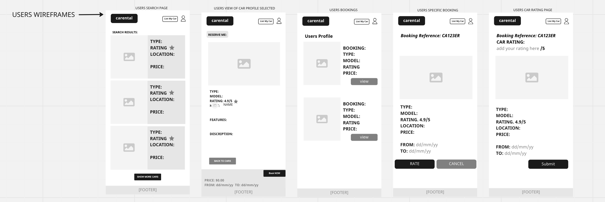
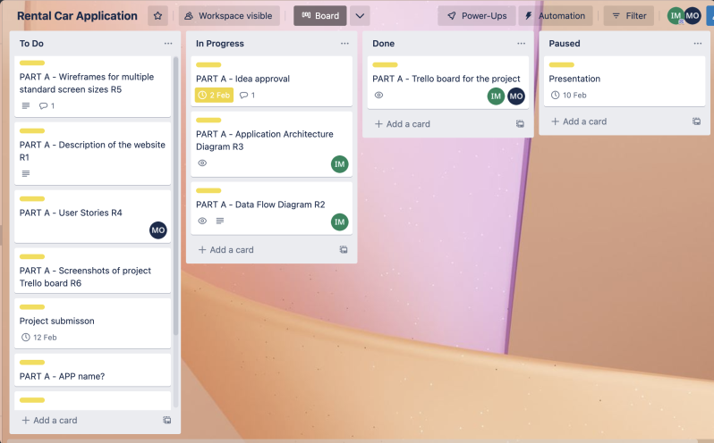

# T3A2_B Carental Irina and Michelle

## Links

### GitHub

[Backend](https://github.com/mogoziri/t3a2_b_irina-michelle_backend)

[Frontend](https://github.com/mogoziri/t3a2_b_irina-michelle_frontend)

### Deployment

[Backend](https://t3a2birina-michellebackend-production.up.railway.app)

[Frontend](https://carental-irina-michelle.netlify.app)

### Project Management

[Trello board](https://trello.com/b/MIjLtO2T/carental-application)

## Libraries

### Front End Libraries

| Library                     | Description                                                                                                                                         |
| --------------------------- | --------------------------------------------------------------------------------------------------------------------------------------------------- |
| @mui/material               | Adaptable and accessible library of React components is offered by MUI such as buttons, etc                                                         |
| @testing-library/jest-dom   | Add-on library for Testing Library that gives Jest users the ability to create their own DOM element matchers                                       |
| @testing-library/react      | Light-weight solution for testing React components.                                                                                                 |
| @testing-library/user-event | Addition to Testing Library that offers a more sophisticated simulation of browser interactions than the built-in fireEvent function                |
| axios                       | A promise-based HTTP Client for the browser and node.js                                                                                             |
| bootstrap                   | A free and open-source CSS framework designed for front-end web development that prioritizes mobile responsiveness.                                 |
| jwt-decode                  | A simple browser library which aids in the decoding of Base64Url encoded JWT tokens                                                                 |
| react                       | A front-end JavaScript toolkit that is free and open-source for creating user interfaces using components                                           |
| react-dom                   | Offers DOM-specific functions that may be used at your app's top level and as a way to leave the React model if necessary                           |
| react-modal                 | An accessible modal dialog component for React.JS                                                                                                   |
| react-router-dom            | Is a client and server-side routeing framework for React with all the features.                                                                     |
| react-scripts               | Includes scripts and configuration used by Create React App                                                                                         |
| react-slick                 | Carousel component built with React                                                                                                                 |
| reactstrap                  | Does not need to utilise or include Bootstrap's JavaScript, and automatically exports all the necessary Bootstrap classes                           |
| remixicon                   | Collection of carefully created system symbols in an open source neutral style for designers and developers. The icons can all be used without cost |
| slick-carousel              | A slideshow feature that functions like a carousel to cycle among components, such as photographs or text slides                                    |
| web-vitals                  | Based on actual usage statistics, indicates how well your pages perform                                                                             |

### Back End Libraries

| Library      | Description                                                                                              |
| ------------ | -------------------------------------------------------------------------------------------------------- |
| bcrypt       | Cryptographic library to hash passwords                                                                  |
| cors         | Express middleware to enable CORS (Cross-Origin Resource Sharing) with different options                 |
| dotenv       | Loads environment variables from .env files                                                              |
| express      | Web application framework for Node.js                                                                    |
| helmet       | Express middleware to set security related HTTP headers                                                  |
| jsonwebtoken | JWT implementation for Node.js                                                                           |
| mongoose     | Object data modelling library for MongoDB                                                                |
| eslint       | Code analysis tool to identify problematic patters in JavaScript code                                    |
| jest         | JavaScript testing framework developed by Facebook                                                       |
| nodemon      | Tool that helps during Node.js application development by automatically restarting server on file change |
| prettier     | Code formatting tool to apply consistent style                                                           |
| supertest    | Node.js library to test APIs, can be used with jest framework                                            |

## The final version of web application wireframes

### Standard Phone Wireframes

### Standard Tablet Wireframes

### Standard Desktop Wireframes

## Development Testing Documentation

| Scenario                                           | Action                                                     | Expected response                                                            | Actual response                                                             |
| -------------------------------------------------- | ---------------------------------------------------------- | ---------------------------------------------------------------------------- | --------------------------------------------------------------------------- |
| Register: User signs up only with username         | User enters only username                                  | Shows an error                                                               | Fail: User registered successfully                                          |
| Register: User signs up with existing username     | User enters existing username                              | Shows an error                                                               | Pass: Shows an error description                                            |
| Login: User logs in only with username or password | User enters only username or password                      | Shows an error                                                               | Pass: Shows an error and missing details description                        |
| Login: User logs in with incorrect password        | User enters incorrect username or password                 | Shows an error                                                               | Pass: Shows an error description                                            |
| List my car: form verification                     | User submits List my car form without all necessary fields | Shows an error                                                               | Fail: Shows an empty page                                                   |
| Update my car: form verification                   | User updates car status to unavailable                     | Car disappears from home page                                                | Fail: car still displayed in home page                                      |
| Book a car: confirm action                         | User creates booking on car details page                   | Car owner gets booking reference on My Cars page                             | Pass: booking available for confirmation or decline on owner's My Cars page |
| My Cars: confirm booking action                    | Owner confirms booking on My Cars page                     | Booking appears on My Bookings page under user account with confirmed status | Pass: booking appears on My Bookings page with declined status              |
| My Cars: decline booking action                    | Owner declines booking on My Cars page                     | Booking appears on My Bookings page under user account with declined status  | Pass: booking appears on My Bookings page with declined status              |
| My bookings: complete booking action               | User completes booking on My Bookings page                 | Booking appears as completed on My Bookings page under user account          | Pass: booking appears as completed on My Bookings page                      |

## Production Testing Documentation

| Scenario                                           | Action                                                     | Expected response                                                            | Actual response                                                             |
| -------------------------------------------------- | ---------------------------------------------------------- | ---------------------------------------------------------------------------- | --------------------------------------------------------------------------- |
| Register: User signs up only with username         | User enters only username                                  | Shows an error                                                               | Pass: Shows an error description                                            |
| Register: User signs up with existing username     | User enters existing username                              | Shows an error                                                               | Pass: Shows an error description                                            |
| Login: User logs in only with username or password | User enters only username or password                      | Shows an error                                                               | Pass: Shows an error and missing details description                        |
| Login: User logs in with incorrect password        | User enters incorrect username or password                 | Shows an error                                                               | Pass: Shows an error description                                            |
| List my car: form verification                     | User submits List my car form without all necessary fields | Shows an error                                                               | Fail: Shows an empty page                                                   |
| Update my car: form verification                   | User updates car status to unavailable                     | Car disappears from home page                                                | Fail: car still displayed in home page                                      |
| Book a car: confirm action                         | User creates booking on car details page                   | Car owner gets booking reference on My Cars page                             | Pass: booking available for confirmation or decline on owner's My Cars page |
| My Cars: confirm booking action                    | Owner confirms booking on My Cars page                     | Booking appears on My Bookings page under user account with confirmed status | Pass: booking appears on My Bookings page with declined status              |
| My Cars: decline booking action                    | Owner declines booking on My Cars page                     | Booking appears on My Bookings page under user account with declined status  | Pass: booking appears on My Bookings page with declined status              |
| My bookings: complete booking action               | User completes booking on My Bookings page                 | Booking appears as completed on My Bookings page under user account          | Pass: booking appears as completed on My Bookings page                      |

# T3A2_A Carental Irina and Michelle

**CARENTAL** A car rental APP

[Github repository](https://github.com/MichelleOha/T3A2_A_Carental_Irina-Michelle)

## R1 Description of your website

### Purpose

Carental is the new way to rent a car. We want to make car sharing simple to use, cost-effective and environmentally friendly.

Car owners can share their cars with others when they are not in use and earn some extra income.
For the users, no need to hire a car for a location that you can't necessarily get to or pay expensive hiring fees, just rent one from someone in your area. It's as simple as that.

### Functionality/ Features

As a user wanting to hire a car, simply search by location and by the date required and book the car you want. The owner will confirm the booking and you're good to go. Rate the car once your booking is complete.

As a car owner, list your car and its availability for hire. Approve the booking request and rate the user.

This app will allow the car owner to add images of their car, select special features such as transmission and set the price per day.

Both the user and owner are able to cancel a booking simply by going into their profile, selecting the booking they wish to cancel and pressing a cancel button.

### Target Audience

- Australian residence.

- Owners and users can be anyone over 21 years of age who has a full current Australian drivers license.

- Owners must own their car and it must be registered.

### Tech Stack

- Javascript
- MongoDB
- React
- HTML
- CSS
- material ui
- Node JS
- Mongoose
- Express

### Project Management Tools

- Miro
- Trello

## R2 Dataflow Diagram

## R3 Application Architecture Diagram

## R4 User Stories

### Users Stories

### Owners Stories

## R5 Wireframes

### Standard Desktop Wireframes

### Standard Phone Wireframes

### Standard Tablet Wireframes

### Brainstorming sketches for wireframes

### Colour Palette for inspiration for website

## R6 Trello Boards

[Trello board](https://trello.com/b/MIjLtO2T/carental-application)

Created Trello board with initial tasks for Part A of project:

Added colour labels for each section "To do", "In Progress" and "Done". Also added users to specific cards:

Added checklists for some of the cards, for example the README where we were to divide the tasks between us:

Added a second label colour once we added Part B tasks so that we knew which belonged to Part A (purple) and which belonged to Part B (blue):

Added our initials to tasks on the checklists so we knew who was going to complete which requirement:

Part A almost completed. Part B in progress:

